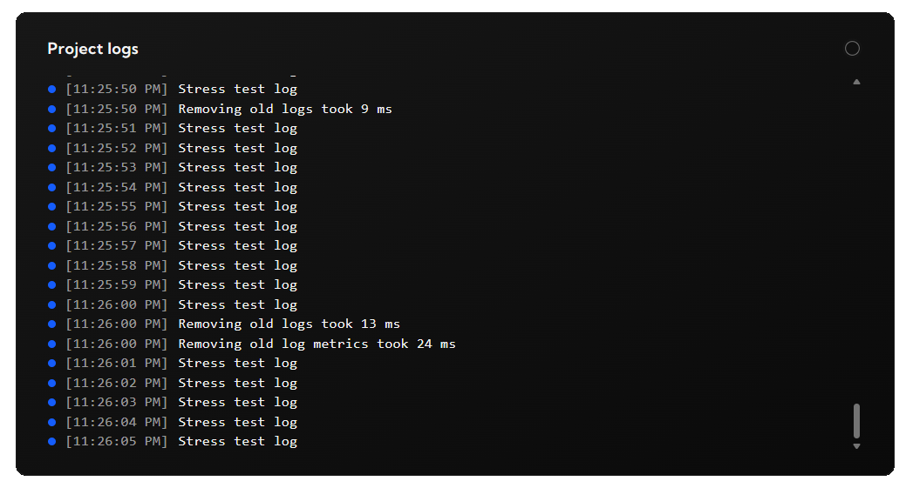

# logdash - Go SDK

[](https://pkg.go.dev/github.com/logdash-io/go-sdk/logdash)

Logdash is a zero-config observability platform. This package serves as a Go interface to use it.

## Pre-requisites

Setup your free project in less than 2 minutes at [logdash.io](https://logdash.io/)

## Installation

```bash
go get github.com/logdash-io/go-sdk/logdash
```

## Logging

```go
import (
	"context"
	"time"

	"github.com/logdash-io/go-sdk/logdash"
)

func main() {
    // Initialize with your API key
    ld := logdash.New(
        // optional, but recommended to see your logs in the dashboard
        logdash.WithApiKey("your-api-key"), // Replace with your actual API key
    )

    // Access the logger
    logger := logdash.logger

    logger.Info("Application started successfully")
    logger.Error("An unexpected error occurred")
    logger.Warn("Low disk space warning")

    // Go specific: all logging methods has ...F() counterpart
    // like fmt.PrinttF for fmt.Print
    logger.InfoF("Processing %v of %v item", i, items)

    // Go specific: Shutdown method wait for flushing 
    // all enqueued logs and metrics before closing application
	ctx, cancel := context.WithTimeout(context.Background(), 10*time.Second)
	defer cancel()
	ld.Shutdown(ctx)
}
```

## Using with slog (Go 1.21+)

The SDK provides a `slog.Handler` wrapper that allows you to use Logdash with Go's standard `log/slog` package.

All features from `slog.HandlerOptions` are supported.

```go
import (
	"log/slog"
	"github.com/logdash-io/go-sdk/logdash"
)

func main() {
	// Create a new Logdash instance
	ld := logdash.New(
		logdash.WithApiKey("your-api-key"),
	)

	// Create a slog.Handler that wraps the Logdash logger
	handler := logdash.NewSlogTextHandler(ld.Logger, slog.HandlerOptions{
		Level: slog.LevelDebug,
        // replace sensitive information
		ReplaceAttr: func(groups []string, a slog.Attr) slog.Attr {
			if a.Key == "token" {
				a.Value = slog.StringValue("********")
			}
			return a
		},
	})

	// Create a new slog.Logger with the Logdash handler
	logger := slog.New(handler)

	// Use the slog logger
	logger.Info("Hello from slog!", "user", "john", "action", "login", "token", "1234567890")
	logger.Error("Something went wrong", "error", "connection timeout")
	logger.Debug("Debug information", "request_id", "12345")

	// You can also use slog.SetDefault to make this the default logger
	slog.SetDefault(logger)

	// Now all slog calls will use Logdash
	slog.Info("This will be logged through Logdash")
	slog.Warn("Warning message with attributes", "severity", "high", "component", "auth")

    // Shutdown method wait for flushing all enqueued logs before closing application
	ctx, cancel := context.WithTimeout(context.Background(), 10*time.Second)
	defer cancel()
	ld.Shutdown(ctx)
}
```

The `SlogHandler` automatically maps slog levels to Logdash levels using comparison-based logic:

**Level Mapping:**
- `slog.LevelError` (8) → `logdash.Error`
- `slog.LevelWarn` (4) → `logdash.Warn`
- `slog.LevelInfo` (0) → `logdash.Info`
- `slog.LevelDebug` (-4) → `logdash.Debug`
- Any level < `slog.LevelDebug` (-4) → `logdash.Silly`

**Intermediate Values:**
Since `slog.Level` is an integer type, the mapping handles any intermediate or custom level values:
- Levels between `slog.LevelDebug` (-4) and `slog.LevelInfo` (0) → `logdash.Debug`
- Levels between `slog.LevelInfo` (0) and `slog.LevelWarn` (4) → `logdash.Info`
- Levels between `slog.LevelWarn` (4) and `slog.LevelError` (8) → `logdash.Warn`
- Levels ≥ `slog.LevelError` (8) → `logdash.Error`

This ensures that any custom slog levels or intermediate values are properly categorized into the appropriate Logdash severity level.

## Metrics

```go
import 	"github.com/logdash-io/go-sdk/logdash"

func main() {
    // Initialize with your API key
    ld := logdash.New(logdash.LogdashConfig{
        // optional, but recommended to see your logs in the dashboard
        logdash.WithApiKey("your-api-key"), // Replace with your actual API key
    })

    // Access metrics
    metrics := logdash.Metrics

    // to set absolute value
    metrics.Set("users", 0)

    // or increment / decrement by
    metrics.Mutate("users", 1)
}
```

## View

To see the logs or metrics, go to your project dashboard




## License

This project is licensed under the MIT License.

## Contributing

Contributions are welcome! Feel free to open issues or submit pull requests.

## Support

If you encounter any issues, please open an issue on GitHub or let us know at [contact@logdash.io](mailto:contact@logdash.io).
