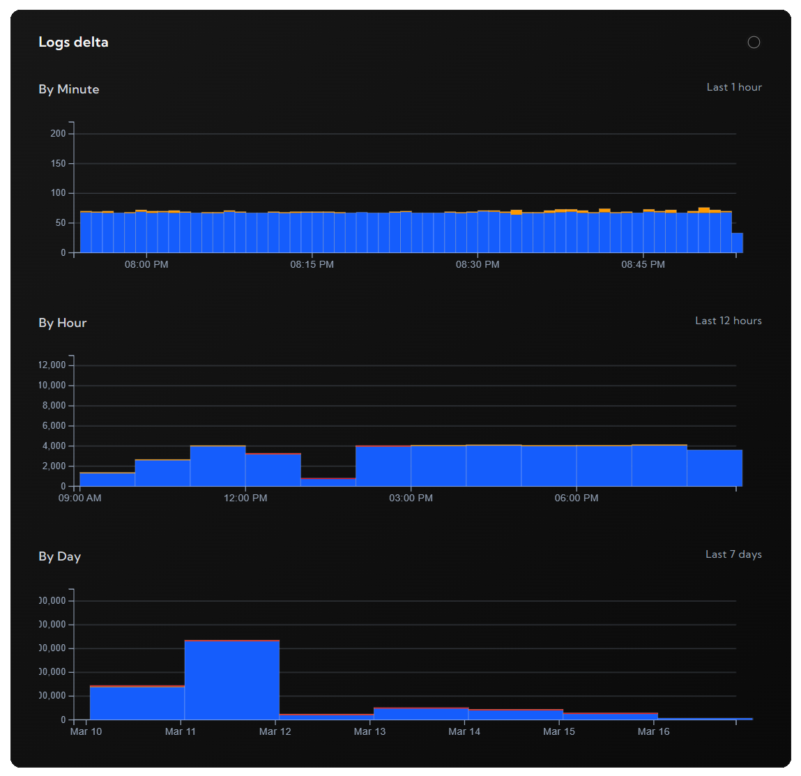

# logdash - Go SDK

[](https://pkg.go.dev/github.com/logdash-io/go-sdk/logdash)

Logdash is a zero-config observability platform. This package serves as a Go interface to use it.

## Pre-requisites

Setup your free project in less than 2 minutes at [logdash.io](https://logdash.io/)

## Installation

```bash
go get github.com/logdash-io/go-sdk/logdash
```

## Logging

```go
import (
	"context"
	"time"

	"github.com/logdash-io/go-sdk/logdash"
)

func main() {
    // Initialize with your API key
    ld := logdash.New(logdash.LogdashConfig{
        // optional, but recommended to see your logs in the dashboard
        APIKey:  "your-api-key", // Replace with your actual API key
    })

    // Access the logger
    logger := logdash.logger

    logger.Info("Application started successfully")
    logger.Error("An unexpected error occurred")
    logger.Warn("Low disk space warning")

    // Go specific: all logging methods has ...F() counterpart
    // like fmt.PrinttF for fmt.Print
    logger.InfoF("Processing %v of %v item", i, items)

    // Go specific: Shutdown method wait for flushing 
    // all enqueued logs and metrics before closing application
	ctx, cancel := context.WithTimeout(context.Background(), 10*time.Second)
	defer cancel()
	ld.Shutdown(ctx)
}
```

## Metrics

```go
import 	"github.com/logdash-io/go-sdk/logdash"

func main() {
    // Initialize with your API key
    ld := logdash.New(logdash.LogdashConfig{
        // optional, but recommended as metrics are only hosted remotely
        APIKey:  "your-api-key", // Replace with your actual API key
    })

    // Access metrics
    metrics := logdash.Metrics

    // to set absolute value
    metrics.Set("users", 0)

    // to modify existing metric
    metrics.Mutate("users", 1)
```

## View

To see the logs or metrics, go to your project dashboard




## License

This project is licensed under the MIT License.

## Contributing

Contributions are welcome! Feel free to open issues or submit pull requests.

## Support

If you encounter any issues, please open an issue on GitHub or let us know at [contact@logdash.io](mailto:contact@logdash.io).
